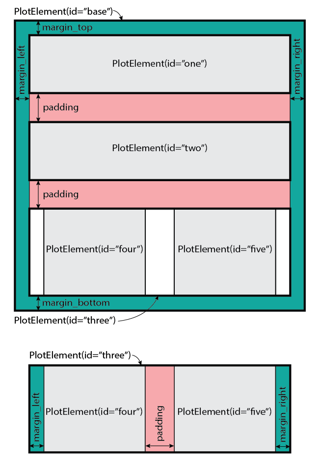
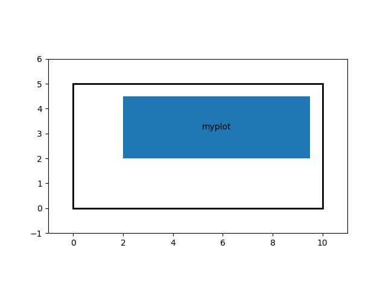
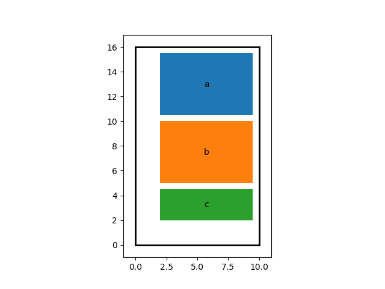
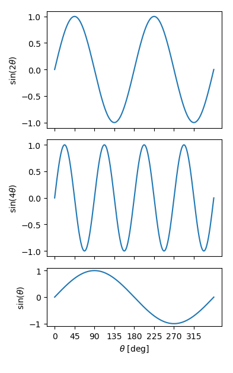

Getting Started
===============

Installation
------------
Zool can be easily installed from the console using ``pip``:

.. code-block:: console

    $ pip install zool

Zool is also developed on GitHub and the current version can be downloaded
and installed directly:

.. code-block:: console

    $ pip install .

Basics
------
A ```Zool``` layout is hierarchical and starts with a base panel that will have the
total dimensions of the figure.  Inside this base panel (and every other ``PlotElement``)
there are margins and all the `child` elements are laid out within these margins with a
set amount of padding between them.



Basic Example
^^^^^^^^^^^^^

A basic example of just constructing a 10 cm by 5 cm figure with 2 cm margin at the left and bottom,
and a 0.5 cm margin at the top and right with a panel inside would look like the following.

1. We import ``zool`` and construct our Layout with the dimensions above.

.. code-block:: python

    import matplotlib.pyplot
    import zool
    layout = zool.Layout(figwidth=10.0, figheight=5.0, margin_left=2.0, margin_right=0.5,
                        margin_top=0.5, margin_bottom=2.0)

2. Now we need to add a PlotElement that will form the axes inside these margins.  Providing
no arguments to the PlotElement() constructor will give us a ``PlotElement`` that takes its
size from the space inside its parent object and no margins.  Its name will be ``myplot``.

.. code-block:: python

    layout["myplot"] = zool.PlotElement()

3. Now we ask ``Zool`` to layout the plot which will solve for the size of all the elements.  In this
case ``Zool`` needs to find the size and position of the inner ``myplot`` element taking into account
the size of the margins and the size of the figure.

.. code-block:: python

    layout.layout()

4. We can preview what this looks like using the `preview` method.  Any parts of the layout
that contain child `PlotElements` (e.g., are containers) will be drawn with no fill and edges,
and any `PlotElements` that have no child elements are filled.

.. code-block:: python

    layout.preview()



5. We can create a ``matplotlib`` figure and axes using:

.. code-block:: python

    layout.figure(
    layout.axes("myplot")
    plt.show()


More involved example
^^^^^^^^^^^^^^^^^^^^^

This is perhaps not particularly useful and is a bit long-winded.  But let's create
a series of vertical panels of varying heights.

1. Same as before, we start out Zool layout but in this case we only fix the figure width,
by omitting a figure height we tell Zool to take it's dimensions from the child elements.  We
need `numpy` as we'll be plotting something later.

.. code-block:: python

    import matplotlib.pyplot as plt
    import numpy as np
    import zool

    layout = zool.Layout(figwidth=10.0, layout='vertical', padding=0.5,
                         margin_left=2, margin_right=0.5, margin_top=0.5, margin_bottom=2.0)

2. Now let's add thre panels, the top two have a height of 5 cm each and the bottom
one has a height of 2.5 cm.

.. code-block:: python

    layout['a'] = zool.PlotElement(height=5.0)
    layout['b'] = zool.PlotElement(height=5.0)
    layout['c'] = zool.PlotElement(height=2.5)

3. As before, we solve the layout and then let's preview it.

.. code-block:: python
    
    layout.layout()
    layout.preview()



4. Now we can plot some data into it.  Let's look at some simple $\sin$ waves

.. code-block:: python

    theta = np.linspace(0, 2*np.pi, 360)

    fig = layout.figure()

    ax = layout.axes("a")
    ax.plot(np.degrees(theta), np.sin(2*theta))
    ax.set_xticklabels([])
    ax.set_xticks(range(0,360,45))
    ax.set_ylabel(r"$\sin(2\theta)$")

    ax = layout.axes("b")
    ax.plot(np.degrees(theta), np.sin(4*theta))
    ax.set_xticklabels([])
    ax.set_xticks(range(0,360,45))
    ax.set_ylabel(r"$\sin(4\theta)$")

    ax = layout.axes("c")
    ax.plot(np.degrees(theta), np.sin(theta))
    ax.set_ylabel(r"$\sin(\theta)$")
    ax.set_xlabel(r"$\theta$ [deg]")
    ax.set_xticks(range(0,360,45))

    plt.show()

Which produces




Simple usage using factories
----------------------------


Making a custom layout
----------------------
